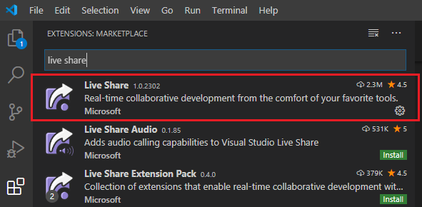
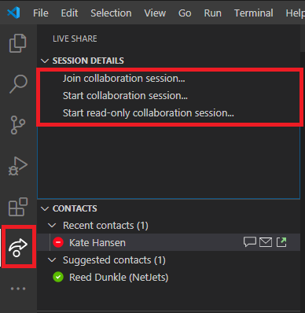
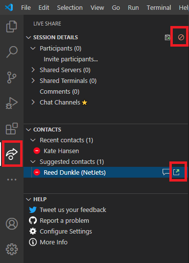
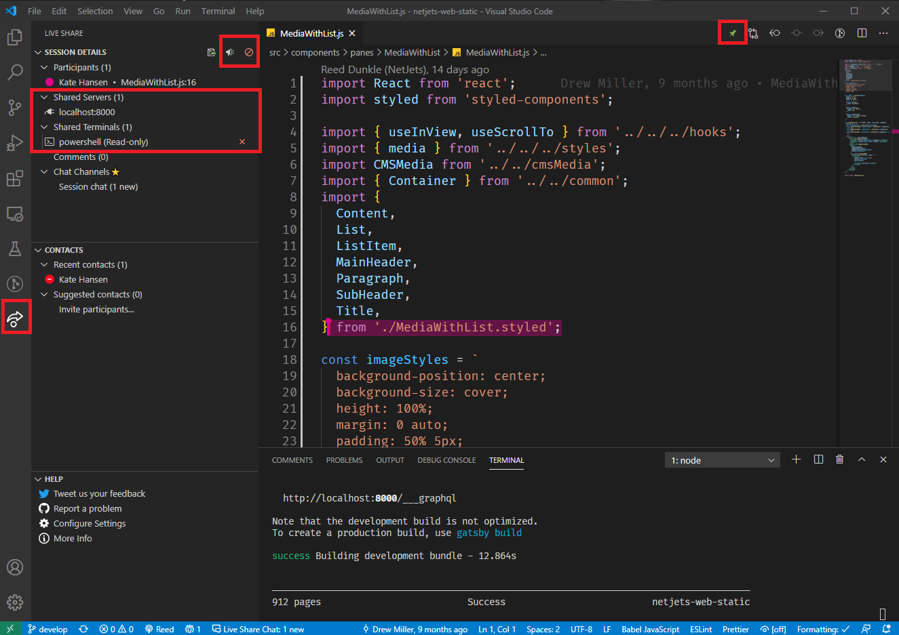

# VS Code

Download: <https://code.visualstudio.com/>

## Install ESLint & Prettier for VSCode

Open Extensions menu in VSCode, and Search for `EsLint` and `Prettier`, and install. Or install from The extension marketplace [here](https://marketplace.visualstudio.com/items?itemName=dbaeumer.vscode-eslint) and [here](https://marketplace.visualstudio.com/items?itemName=esbenp.prettier-vscode).

### Install Packages

- Open a command line tool, `crt + j` inside VSCode.
- Run `npm init -y` to create a `package.json` file
- Run `npm i -D eslint prettier eslint-plugin-prettier eslint-config-prettier` to install as a dev dependency.

Optional additional packages that can be included in the above install:

- Airbnb's ESLint rules, including ECMAScript 6+ and React `npx install-peerdeps --dev eslint-config-airbnb` OR if you don't want React `npx install-peerdeps --dev eslint-config-airbnb-base`
- React specific linting rules for ESLint `npm install eslint-plugin-react --save-dev`

### Create ESLint Config

- Run `eslint --init` and follow command prompts to create [.eslintrc.js](/.eslintrc.js)
- Remove all generated code except for `extends` and `rules`
- Add `plugins` to exports, and include the `prettier` plugin.
- Include `prettier/prettier` in the rules
- Reference [eslintrc.js](/.eslintrc.js)

```js
module.exports = {
  extends: ["airbnb", "prettier"],
  plugins: ["prettier"],
  rules: {
    "prettier/prettier": "error",
  },
};
```

### Create Prettier Config

- Add `"prettier/prettier": "error",` to the rules in the [.eslintrc.js](/.eslintrc.js)
- If a local set of prettier rules is needed
  - In root of project create a file named `.prettierrc` for prettier rules
  - [Prettier rules can be found here](https://prettier.io/docs/en/options.html)

### Custom Configurations

Additional linting rules can be found at <https://eslint.org/docs/rules/>

- Suggested CSS linting rules [can be found here](/css/.csslintrc).
- A few suggested JavaScript [configuration objects can be found here](/javascript/.eslintrc)
- A few additional JavaScript [linting rules can be found here](/javascript/.jscsrc)

## Pairing with [Live Share](https://visualstudio.microsoft.com/services/live-share/)

### Install the Live Share Extension

- Search for **"Live Share"** in the Extensions Marketplace, published by Microsoft



### Start or Join a Session

- Select the now-installed Live Share extension on the left icon bar
- Click **"Join collaboration session..."** or **"Start collaboration session..."**, and sign in using a GitHub (or Microsoft) account
- After starting a session, it will generate a URL that you can share with people to invite them
- You can alternatively invite people through the **"Contacts"** section
- Close a sharing session by pressing the red prohibited symbol (🚫&nbsp;&nbsp;&nbsp;) in the top-right of the **"Session Details"** section

<table>
  <tr>
    <td></td>
    <td></td>
  </tr>
  <tr>
    <td align="center">Start or Join a session</td>
    <td align="center">Close session, or invite contacts</td>
  </tr>
</table>

### Pairing Features

- You'll see collaborators' cursors and edits, similar to Google Docs
- You can follow a collaborator by clicking the pin near the top-right of VS Code, quickly jumping to where someone is working.
  - You'll follow their cursor in an open file, as well as see any additional files they may open.
- Using the VS Code terminal, you can share local development servers with collaborators
- You can give collaborators **write-access** to the VS Code terminal by right-clicking a shared terminal under **"Shared Terminals"**, and selecting **"Make Read/Write"**
- Stop sharing terminals or servers by right-clicking on them under **"Session Details"**, or clicking the red X (❌&nbsp;&nbsp;&nbsp;) to the right of the item



### References

- [ESLint Rules](https://eslint.org/docs/rules/)
- [Prettier Options](https://prettier.io/docs/en/options.html)
- [Airbnb Style Guide](https://github.com/airbnb/javascript)
- [VS Code](https://code.visualstudio.com/)
- [ESLint Plugin](https://marketplace.visualstudio.com/items?itemName=dbaeumer.vscode-eslint)
- [Prettier Plugin](https://marketplace.visualstudio.com/items?itemName=esbenp.prettier-vscode)
- [Live Share](https://visualstudio.microsoft.com/services/live-share/)
